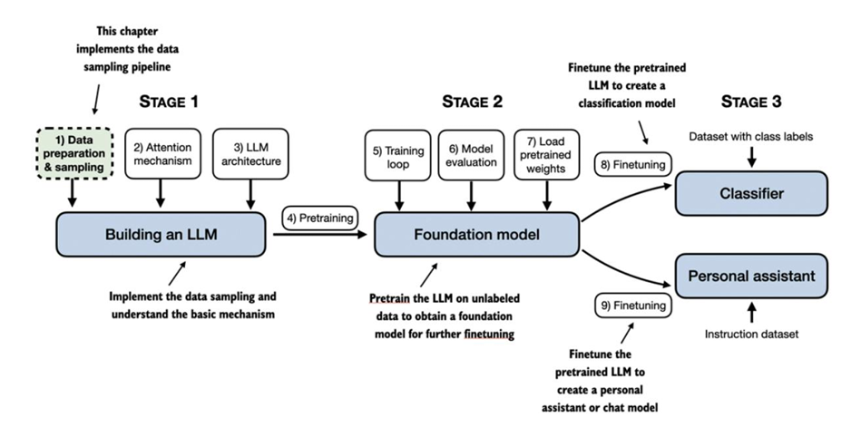
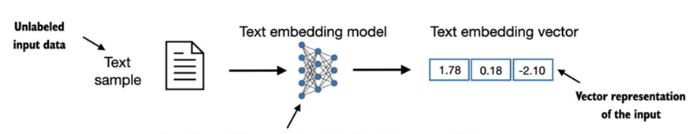

# Trabajando con datos de Texto

## Introducción
Entrenar LLM con millones o miles de millones de parámetros mediante tareas de predicción de la siguiente palabra produce modelos con capacidades impresionantes. Estos modelos pueden ajustarse aún más para seguir instrucciones generales o realizar tareas específicas.

Sin embargo, antes de implementar y entrenar los LLM en los próximos capítulos, es necesario preparar el conjunto de datos de entrenamiento.

## Comprensión  de  las  incrustaciones  de  palabras

Los modelos de redes neuronales profundas, incluyendo los LLM, no pueden procesar texto en bruto directamente.
Dado que el texto es categórico, no es compatible con las operaciones matemáticas utilizadas para implementar y entrenar redes neuronales. Por lo tanto, necesitamos una forma de representar palabras como vectores de valores continuos.

La idea de convertir datos a un formato vectorial se denomina incrustación (embedding).

En esencia, una incrustación es un mapeo de objetos discretos —como palabras, imágenes o incluso documentos completos— a puntos en un espacio vectorial continuo. El propósito principal de las incrustaciones es convertir datos no numéricos en un formato que las redes neuronales puedan procesar.

Dado que nuestro objetivo es entrenar LLM similares a GPT, que aprenden a generar texto palabra por palabra, nos centramos en las incrustaciones de palabras.

Se han desarrollado varios algoritmos y marcos para generar incrustaciones de palabras. Uno de los ejemplos más antiguos y populares es Word2Vec. Este modelo entrena una arquitectura de red neuronal para generar incrustaciones de palabras mediante la predicción del contexto de una palabra dada la palabra objetivo, o viceversa. La idea principal es que las palabras que aparecen en contextos similares tienden a tener significados similares.

Si bien podemos usar modelos preentrenados como Word2Vec para generar incrustaciones para modelos de aprendizaje automático, los LLM suelen generar sus propias incrustaciones como parte de la capa de entrada, actualizándolas durante el entrenamiento. La ventaja de optimizar las incrustaciones durante el entrenamiento de LLM, en lugar de usar Word2Vec, es que se adaptan a la tarea y a los datos específicos.

Tanto en GPT-2 como en GPT-3, el tamaño de la incrustación (a menudo denominado dimensionalidad de los estados ocultos del modelo) varía según la variante y el tamaño del modelo. Esto representa un equilibrio entre rendimiento y eficiencia.

- Los modelos GPT-2 más pequeños (117M y 125M parámetros) usan un tamaño de incrustación de 768 dimensiones.

- El modelo GPT-3 más grande (175B parámetros) usa un tamaño de incrustación de 12,288 dimensiones.

[Preparación de incrustaciones](./1_tokenizacion_texto.ipynb)