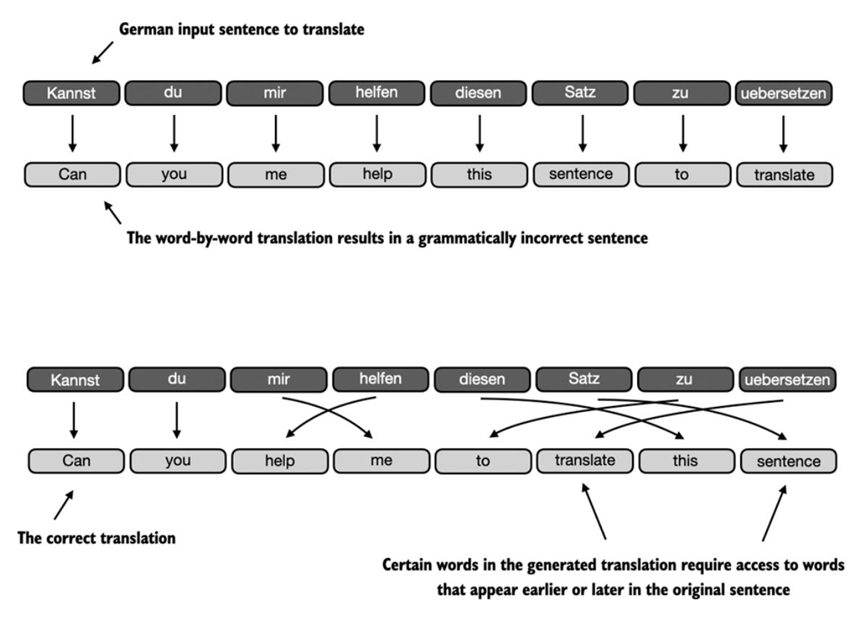
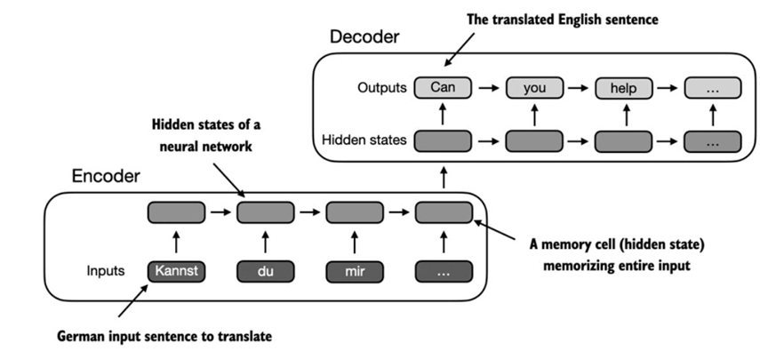

# Problema de modelar secuencias largas

Antes de la llegada de los transformadores, las redes neuronales recurrentes (RNN) con arquitectura codificador-decodificador fueron la opción más utilizada en tareas de traducción automática. En este enfoque, el codificador procesaba la oración de entrada de forma secuencial, actualizando un estado oculto que pretendía condensar todo el significado en una representación final. Posteriormente, el decodificador usaba este estado oculto para generar la traducción palabra por palabra, manteniendo también su propio estado oculto para predecir el siguiente token.

Aunque este esquema permitió avances en el procesamiento de texto, su principal limitación radicaba en que el decodificador dependía únicamente del último estado oculto del codificador, sin poder acceder directamente a los estados intermedios. Esto suponía una pérdida de contexto en secuencias largas, especialmente cuando las dependencias gramaticales y semánticas se extendían a lo largo de la oración. En consecuencia, las RNN tendían a fallar al manejar oraciones complejas o con relaciones de largo alcance, lo que impulsó el desarrollo de los mecanismos de atención como solución a estas deficiencias.

[Prs](./.md)