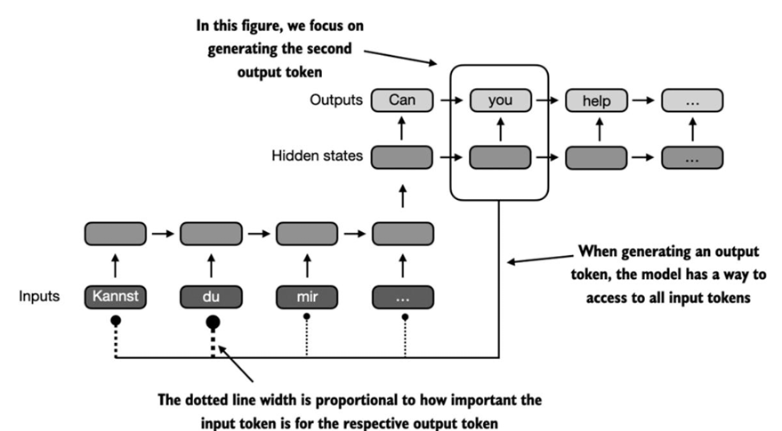
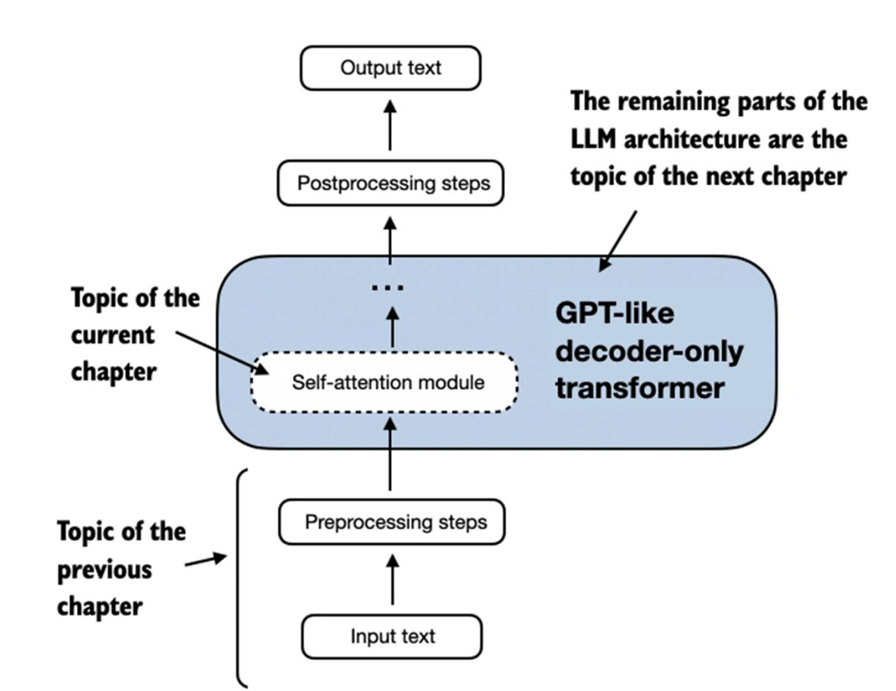

# Captura de dependecias de datos con mecanismo de atención
Antes  de  los  LLM  de  transformadores,  era  común  usar  RNN  para  tareas  de  modelado  lingüístico,  como  la  traducción,  como  se  mencionó  anteriormente.  Las  RNN  funcionan  bien  para  traducir  oraciones  cortas,  pero  no  para  textos  más  largos,  ya  que  no  tienen  acceso  directo  a  las  palabras  anteriores  en  la  entrada.

Por  lo  tanto,  los  investigadores  desarrollaron  el  llamado  mecanismo  de  atención  Bahdanau  para  RNN  en  2014  (llamado  así  por  el  primer  autor  del  artículo  respectivo),  que  modifica  el  RNN  codificadordescodificador  de  modo  que  el  decodificador  pueda  acceder  selectivamente  a  diferentes  partes  de  la  
secuencia  de  entrada  en  cada  paso  de  decodificación 

Curiosamente,  solo  tres  años  después,  los  investigadores  descubrieron  que  las  arquitecturas  RNN  no  son  necesarias  para  construir  redes  neuronales  profundas  para  el  procesamiento  del  lenguaje  natural  y  propusieron  la  arquitectura  de  transformador  original

La  autoatención  es  un  mecanismo  que  permite  que  cada  posición  en  la  secuencia  de  entrada  preste  atención  a  todas  las  posiciones  en  la  misma  secuencia  al  calcular  la  representación  de  una  secuencia.
La  autoatención  es  un  componente  clave  de  los  LLM  contemporáneos  basados  en  la  arquitectura  del  transformador,  como  la  serie  GPT.

[Atender a diferentes partes de la entrada con autoatención](./3_atender_diferentes_partes_autoantencion)