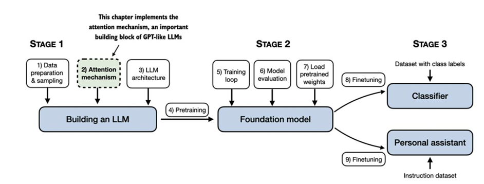
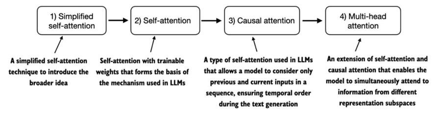

# Mecanismo de codificación de la atención

## Introducción
En la sección anterior se abordó la preparación del texto de entrada para el entrenamiento de un LLM, lo que incluyó la tokenización y su conversión en incrustaciones vectoriales. En esta sección, el foco se traslada hacia los mecanismos de atención, un componente central en la arquitectura de los modelos de lenguaje.

El texto expone la importancia de entender estos mecanismos de manera aislada antes de integrarlos en el modelo completo. Se presentan cuatro variantes principales: la autoatención simplificada, la autoatención con pesos entrenables, la atención causal —que introduce una máscara para que el modelo genere palabra por palabra de forma secuencial— y la atención multicabezal, que permite procesar en paralelo diferentes representaciones del contexto para capturar múltiples aspectos de los datos.

El objetivo es implementar progresivamente estas variantes hasta llegar a una versión compacta y eficiente de la atención multicabezal, la cual servirá como base para la construcción de un LLM funcional en los siguientes apartados del libro.

[Captura de dependencias con mecanismos de atención](./2_captura_dependecias_mecanismos_atencio.md)