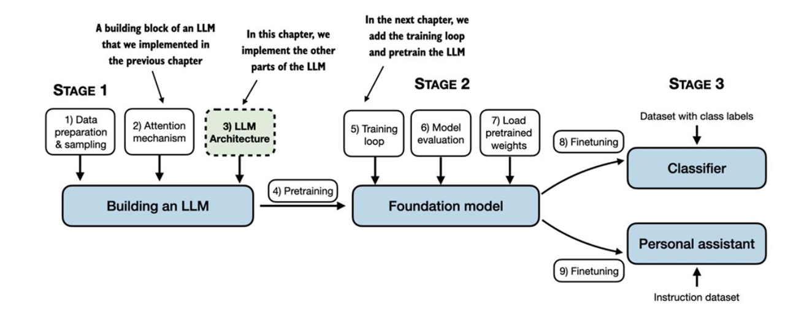

# Introducción

En esta sección se detallará como codificar losdemás componentes básicos de un LLM y esamblarlos en un modelo GPT que se entrenará en la siguiente sección.

La arquitectura LLM que se muestra en la figura, consta de varios bloques que se van a ir implementando.

En la siguiente sección, se mostrará una visión general de la arquitectura del modelo antes de analizar los componentes al detalle.

[Codificación de la arquitectura LLM](./1_codificacion_arquitectura_LLM.ipynb)