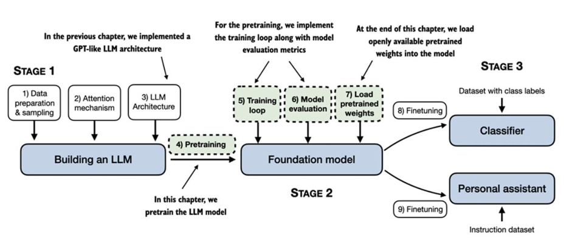

# Preentrenamiento en datos sin etiquetar

En  las secciones anteriores, se implementó el  muestreo  de  datos,  el  mecanismo  de  atención  y  codificamos  la  arquitectura  LLM.  El  objetivo  principal  de esta sección  es  implementar  una  función  de  entrenamiento  y  preentrenamiento de el LLM.

Esta sección  se  centra  en  el  preentrenamiento  del  LLM,  que  incluye  la  implementación  del  código  de  entrenamiento,  la  evaluación  del  rendimiento  y  el almacenamiento  y  la  carga  de  los  pesos  del  modelo.

También se va a ver técnicas  básicas  de  evaluación  de  modelos  para  medir  la  calidad  del  texto  generado,  requisito  indispensable  para  optimizar  el  LLM  durante  el  proceso  de  entrenamiento.  Además,  de análisis de  cómo  cargar  pesos  preentrenados,  lo  que  proporcionará  a  nuestro  LLM  un  punto  de  partida  sólido  para  su  ajuste  futuro.

### Parámetros de peso

En los LLM y otros modelos de aprendizaje profundo, los pesos (o parámetros entrenables) son los valores que el modelo ajusta durante el proceso de aprendizaje. En PyTorch, estos pesos se almacenan dentro de las capas del modelo —por ejemplo, en capas lineales como las usadas en el módulo de atención multicabezal o en el GPTModel.

Tras crear una capa (new_layer = torch.nn.Linear(...)), sus pesos pueden consultarse mediante new_layer.weight. Además, PyTorch ofrece el método model.parameters() para acceder a todos los parámetros entrenables del modelo (pesos y sesgos), lo cual resulta útil durante el entrenamiento.

[Evaluación de modelos de texto generativo](./1_evaluacion_modelos_texto_generativo.ipynb)