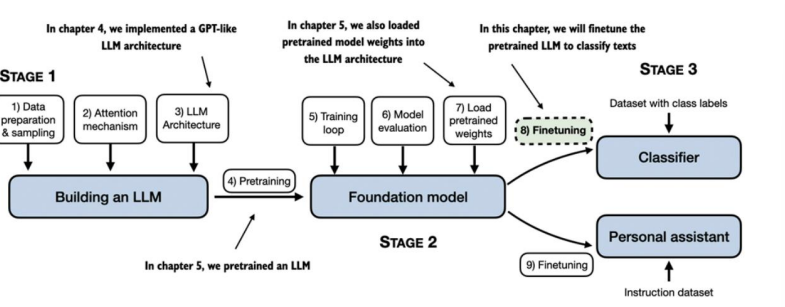

# Ajuste fino para Clasificación

En secciones anteriores, se codificó la arquitectura LLM, se preentreno y se importaron ponderaciones preentrenadas desde una fuente externa, como OpenAI. En esta sección se ajutará el LLM a una tarea específica, como la clasificación de texto.

La figura muestra dos métodos principales para ajustar un LLM: ajuste para la clasificación (paso 8) y ajuste para el seguimiento de instrucciones (paso 9). 

[Diferente categorías de ajuste fino](./1_categorias_ajuste_fino.md)