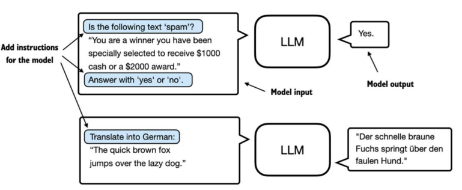
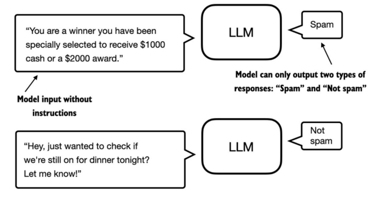

# Diferentes categorías de ajuste fino

Las formas más comunes de perfeccionar los modelos lingüísticos son el perfeccionamiento de instrucciones y el perfeccionamiento de clasificación. El perfeccionamiento de instrucciones implica entrenar un modelo lingüístico en un conjunto de tareas mediante instrucciones específicas para mejorar su capacidad de comprender y ejecutar tareas descritas en indicaciones de lenguaje natural.

Esta sección se centra en el ajuste fino de clasificación.

En el ajuste fino de la clasificación, el modelo se entrena para reconocer un conjunto específico de etiquetas de clase, como "spam" y "no es spam". Las tareas de clasificación van más allá de los grandes modelos de lenguaje y el filtrado de correo electrónico; incluyen la identificación de diferentes especies de plantas a partir de imágenes, la categorización de noticias en temas como deportes, política o tecnología, y la distinción entre tumores benignos y malignos en imágenes médicas.

El punto clave es que un modelo de clasificación afinada está restringido a predecir las clases que ha encontrado durante su entrenamiento; por ejemplo, puede determinar si algo es "spam" o "no es spam", pero no puede decir nada más sobre el texto de entrada.

A diferencia del modelo de clasificación finamente ajustado que se muestra en la figura, un modelo de instrucción finamente ajustado suele tener la capacidad de realizar una gama más amplia de tareas. Se puede considerar un modelo de clasificación finamente ajustado como altamente especializado y, por lo general, es más fácil desarrollar un modelo especializado que un modelo generalista que funcione bien en diversas tareas.

### Ajuste fino de instrucciones

El ajuste fino de instrucciones mejora la capacidad de un modelo para comprender y generar respuestas según instrucciones específicas del usuario. Es ideal para modelos que necesitan gestionar diversas tareas basadas en instrucciones complejas del usuario, lo que mejora la flexibilidad y la calidad de la interacción.

El ajuste fino de clasificación, por otro lado, es ideal para proyectos que requieren una categorización precisa de datos en clases predefinidas, como el análisis de sentimientos o la detección de spam.

Si bien el ajuste fino de instrucciones es más versátil, requiere conjuntos de datos más grandes y mayores recursos computacionales para desarrollar modelos competentes en diversas tareas. Por el contrario, el ajuste fino de clasificación requiere menos datos y capacidad computacional, pero su uso se limita a las clases específicas con las que se ha entrenado el modelo.

[Preparación del conjunto de datos](./2_preparacion_conjunto_datos.ipynb)