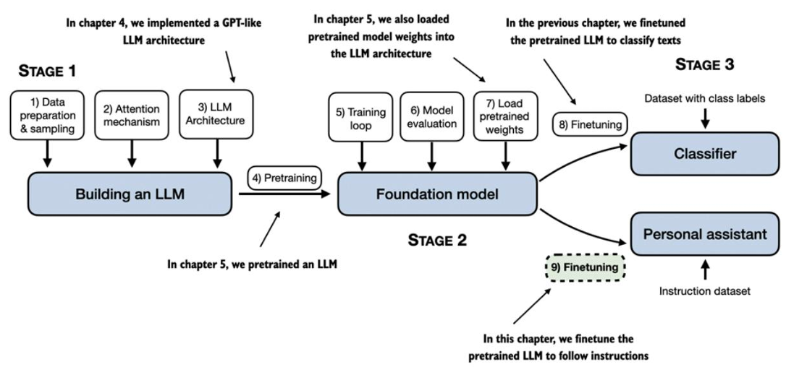

# Ajuste fino para seguir Instrucciones

En secciones anteriores  se implementó la  arquitectura  LLM, se realizó  un  preentrenamiento  e  importó  pesos  preentrenados  de  fuentes  externas  al  modelo.  Posteriormente,  en la sección 06,  se centró  en  perfeccionar  el modelo LLM  para  una  tarea  de  clasificación  específica:  distinguir  entre  mensajes  de  texto  spam  y  no  spam.  En  esta sección,  se va a implementar el  proceso  de  perfeccionamiento  de  un  LLM  para  que  siga  instrucciones  humanas,  como  se  ilustra  en  la  figura,  que  constituye  una  de  las  principales  técnicas  de  desarrollo  de  LLM  para  aplicaciones  de  chatbots,  asistentes  personales  y  otras  tareas  conversacionales.

La figura muestra  dos  métodos  principales  para  ajustar  un  LLM:  ajuste  para  la  clasificación  (paso  8)  y  ajuste  para  el  seguimiento  de  instrucciones  (paso  9).  Se implmentó  el  paso  8  en  la sección anterior.  Esta sección se  centra  en  el  ajuste  de  un  LLM  mediante  un  conjunto  de  datos  de  instrucciones.

[Introducción al ajuste fino de instrucciones](./1_introduccion_ajuste_fino_instrucciones.md)