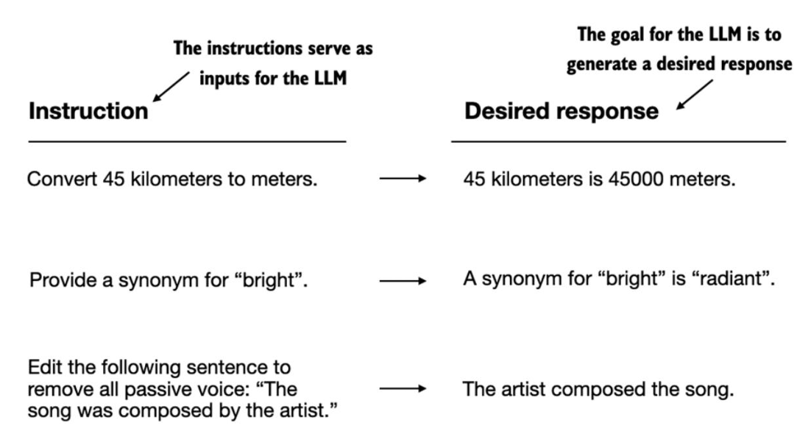
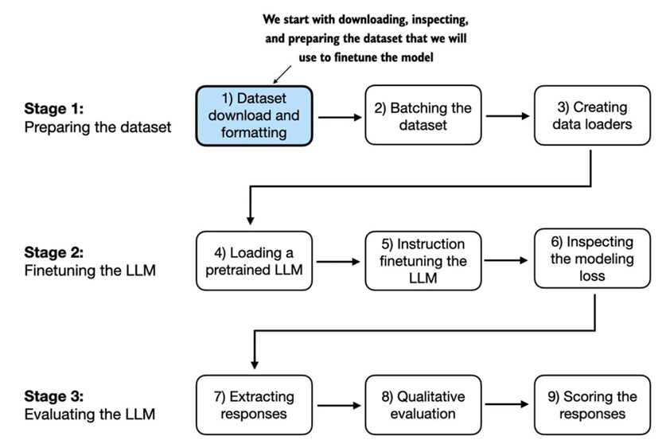

# Introducción al ajuste fino de instrucciones

En la sección 05, se introdujo que  el  preentrenamiento  de  un  LLM  implica  un  proceso  de  entrenamiento  donde  aprende  a  generar  una  palabra  a  la  vez.  El  LLM  preentrenado  resultante  es  capaz  de  completar  texto,  lo  que  significa  que  puede  completar  oraciones  o  escribir  párrafos  de  texto  con  un  fragmento  como  entrada. Sin  embargo,  los  LLM  preentrenados  suelen  tener  dificultades  con  instrucciones  específicas,  como  "Corregir  la  gramática  de  este  texto"  o  "Convertir  este  texto  a  voz  pasiva".  

Esta sección, se va a centrar en  mejorar  la  capacidad  del  LLM  para  seguir  dichas  instrucciones  ygenerar  una  respuesta  deseada.

Pasos para el procesos de ajuste de instrucciones:

La  preparación  del  conjunto  de  datos  es  un  aspecto  clave  del  ajuste  de  instrucciones,  al  que  se  dedica  la  mayor  parte  del  tiempo  de esta sección.  La  siguiente  sección,  implementa  el  código  para  descargar  y  formatear  el  conjunto  de  datos,  que  constituye  el  primer  paso  en  el  proceso  de  preparación.

[Preparación de un conjunto de datos para el ajuste fino de instrucciones supervisadas](./2_preparacion_conjunto_datos_instrucciones.ipynb)
